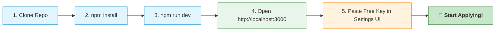

# HireMe — Personal AI Job Assistant

Your personal AI-powered job search, matching, and auto-apply assistant.  
Runs **100% locally on your computer** — no cloud subscriptions, no shared accounts, no fees.

---

> ### 🚀 Zero-Configuration Quick Start
> - ❌ **No `.env` files to create, copy, or edit**
> - ❌ **No Chromium or Playwright binaries to install** (automatically uses your installed Google Chrome)
> - ❌ **No backend terminal configuration**
> - ✅ **Everything is configured directly inside the friendly Web UI!**

---

---

## ⚡ Setup in 3 Minutes



### Prerequisites
1. **Node.js (v18+)**: Download the LTS installer from [nodejs.org](https://nodejs.org) if you haven't already.
2. **Google Chrome**: Already installed on almost all computers. HireMe connects directly to your normal Chrome browser.

---

### Step 1: Clone & Launch

Open your terminal (PowerShell, Command Prompt, or Terminal) and run:

```bash
git clone https://github.com/cshariharan01/HireMe.git
cd HireMe
npm install
npm run dev
```

> 💡 **Windows Shortcut:** You can also simply double-click `start.bat`!  
> 💡 **Mac / Linux Shortcut:** You can run `bash start.sh`!  
> 💡 **No terminal configuration needed:** You do NOT need to touch any code, backend files, or terminal scripts after running this command!

Open your browser and navigate to:  
👉 **[http://localhost:3000](http://localhost:3000)** *(or `http://localhost:3001` if using `start.bat`)*

---

### Step 2: Configure Your Free AI Key in the UI

1. Get a **100% free API key** from [Google AI Studio](https://aistudio.google.com/apikey) *(takes 15 seconds, no credit card required, includes 1,500 free requests per day)*.
2. Open HireMe at **[http://localhost:3000/settings](http://localhost:3000/settings)** (or click **Settings** in the top navigation).
3. Under **Google Gemini**, paste your API key and click **Add Provider**.
4. **Done!** HireMe automatically validates the key, activates it, and configures the backend immediately. You never need to edit `.env` or restart your server.

---

### Step 3: Upload Your Resume

1. Go to **Profile** in the top navigation ([http://localhost:3000/profile](http://localhost:3000/profile)).
2. Upload your existing resume (`.pdf`, `.docx`, or `.txt`).
3. HireMe's local AI parser will automatically extract your work experience, skills, achievements, and target roles.

---

### Step 4: Discover & Apply

1. Go to **Jobs** ([http://localhost:3000/jobs](http://localhost:3000/jobs)).
2. Click **Sync** to fetch the latest job postings from LinkedIn and Naukri tailored to your profile.
3. Review match scores, inspect tailored resume suggestions, and click **Auto-Apply**!
4. The first time you apply, a Chrome window will appear for you to log in to LinkedIn or Naukri. Your login session is saved locally in `data/playwright/` so you only log in once.
5. All subsequent applications run smoothly in the background without stealing your window focus.

---

## ❓ Frequently Asked Questions (FAQ)

### Do my friends or I need to copy `.env.example` to `.env`?
**No, absolutely not.** You never need to create, copy, or edit `.env` files. When you enter your API key in the **Settings** page of the web application, HireMe automatically writes, encrypts, and synchronizes it to the backend environment in real time.

### Do I need to install Chromium or run `npx playwright install`?
**No.** HireMe features native Chrome auto-detection. As long as you have standard **Google Chrome** installed on your computer (Windows, Mac, or Linux), HireMe will use it directly. You do not need to download hundreds of megabytes of extra browser binaries.

*Note: If you do not have Google Chrome installed, HireMe will automatically prompt or fall back to Playwright's Chromium (`npx playwright install chromium`).*

### How do logins work for LinkedIn and Naukri?
When you trigger an application for the first time:
- A Chrome browser window opens to the platform login page.
- You log in manually with your account (or Google Login).
- HireMe securely caches your session cookies locally in `data/playwright/`.
- Future applications use the saved cookies automatically without asking you to log in again.

### Will auto-apply steal focus while I am working on my computer?
**No.** We designed HireMe to be non-intrusive. The browser runs quietly in the background. It will only bring the window to the front if manual intervention is genuinely needed (such as solving a security CAPTCHA on initial login).

### Where is my personal data stored?
Everything stays **100% on your own local machine**:
- **Database**: Local SQLite database at `data/hireme.db`
- **Session cookies**: Local folder at `data/playwright/`
- **Resumes & Profiles**: Stored only in your local database
- No third-party servers, tracking, or cloud databases are involved. The only outgoing network calls are direct requests to your chosen AI provider using your own API key.

---

## ✨ Key Features

- 🎯 **Smart Match Scoring**: Calculates instant match scores against job descriptions and identifies missing keywords.
- 📝 **Resume Tailoring**: Generates tailored versions of your resume targeted to specific job descriptions with one click.
- ✉️ **Custom Cover Letters**: Automatically generates personalized, highly relevant cover letters.
- 🤖 **Background Auto-Apply**: Streamlined application automation for LinkedIn Easy Apply and Naukri chatbot applications.
- 📊 **Application Kanban Tracker**: Visual status tracking across *Discovered*, *Applied*, *Screening*, *Interviewing*, and *Offered*.
- 🧠 **Multiple AI Providers**: Native support for Google Gemini (Free), Anthropic Claude, OpenAI, and local Ollama.

---

## 🛠️ Helpful Commands

| Action | Command |
|---|---|
| Start application | `npm run dev` (or double-click `start.bat`) |
| Stop application | Press `Ctrl + C` in your terminal |
| Update to latest version | `git pull && npm install` |
| Run test suite | `npm test` |
| Reset database | `npm run db:reset` |

---

## 📄 License

MIT License — free for personal use and modification.
